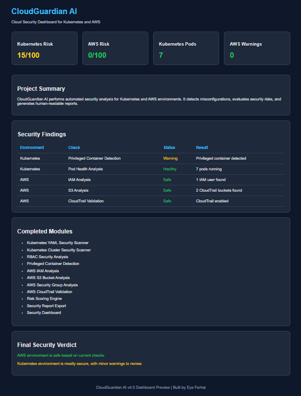

# CloudGuardian AI

AI-Powered Cloud Security Platform for AWS and Kubernetes

CloudGuardian AI is an open-source cloud security platform designed to identify security risks, misconfigurations, and compliance issues across Kubernetes clusters and AWS environments.

The platform performs automated security assessments, calculates risk scores, generates security reports, and provides an interactive dashboard for visualizing security findings.

---

## Dashboard Preview

---

## Features

### Kubernetes Security

- Kubernetes YAML Security Scanner
- Kubernetes Cluster Security Scanner
- RBAC Security Analysis
- Privileged Container Detection
- Wildcard Permission Detection
- Pod Health Analysis
- Container Security Analysis
- Cluster Risk Assessment

### AWS Security

- IAM Analysis
- S3 Bucket Security Review
- Security Group Assessment
- CloudTrail Validation
- AWS Risk Scoring
- AWS Security Reporting

### Reporting & Visualization

- Security Risk Scoring Engine
- Security Report Generation
- Security Report Export
- Interactive Security Dashboard
- Security Findings Visualization

---

## Technology Stack

- Python
- Kubernetes
- AWS
- HTML
- CSS

---

## Roadmap

### Version 1 – Kubernetes YAML Security Scanner  COMPLETED

* YAML Security Analysis
* RBAC Security Analysis
* ServiceAccount Validation
* Namespace Security Validation
* Risk Scoring Engine
* Report Generation

### Version 2 – Kubernetes Cluster Security Scanner  COMPLETED

* Live Cluster Security Auditing
* Pod Health Analysis
* Container Image Analysis
* Privileged Container Detection
* RBAC Security Review
* Wildcard Permission Detection
* Cluster-Wide Risk Assessment
* Security Risk Scoring
* Report Generation and Export

### Version 3 – AWS Security Scanner  COMPLETED

* IAM Analysis
* S3 Security Review
* Security Group Assessment
* CloudTrail Validation
* AWS Risk Scoring
* AWS Security Reporting

### Version 4 – Security Dashboard  COMPLETED

* Web Dashboard
* Security Findings Visualization
* Risk Metrics
* Security Status Overview
* Dashboard Reporting

### Version 5 – Compliance Engine  COMPLETED

* CIS Benchmark Validation
* Security Best Practices Verification
* Compliance Reporting

### Version 6 – AI Remediation Engine  FUTURE

* Amazon Bedrock Integration
* AI-Generated Fix Recommendations
* Intelligent Security Explanations

---

## Project Status

**Status:** Active Development

**Current Release:** CloudGuardian AI v4.0

### Completed Modules

- Kubernetes YAML Security Scanner
- Kubernetes Cluster Security Scanner
- Pod Security Analysis
- Container Security Analysis
- RBAC Security Analysis
- Wildcard Permission Detection
- Privileged Container Detection
- AWS IAM Analysis
- AWS S3 Bucket Analysis
- AWS Security Group Analysis
- AWS CloudTrail Validation
- AWS Risk Scoring Engine
- Security Dashboard
- Security Report Generation
- Security Report Export

---

## License

This project is licensed under the MIT License.

---

## Author

**Eya Farhat**

CloudGuardian AI Security Platform
